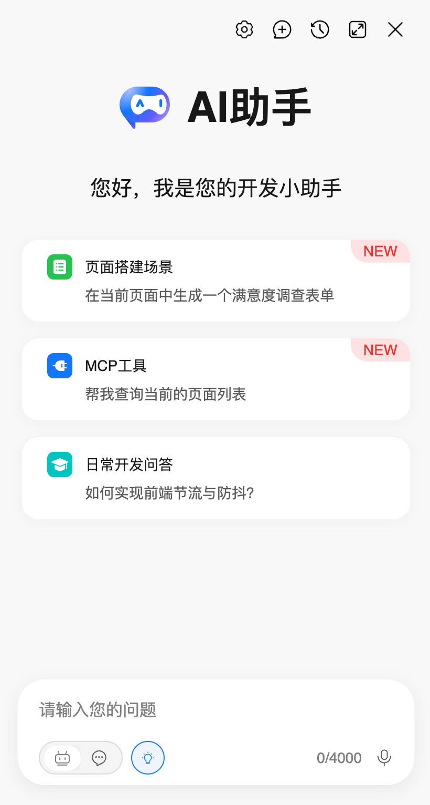
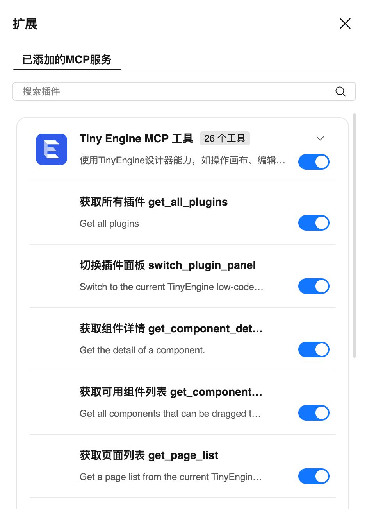
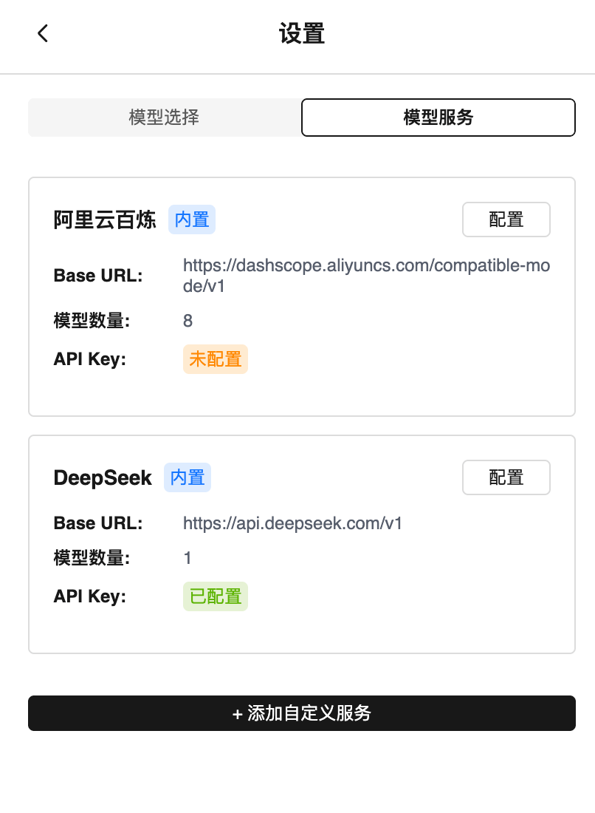
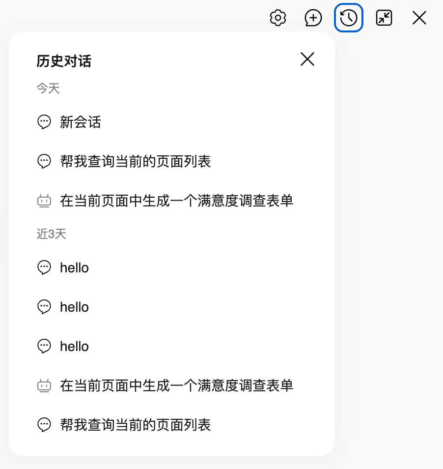
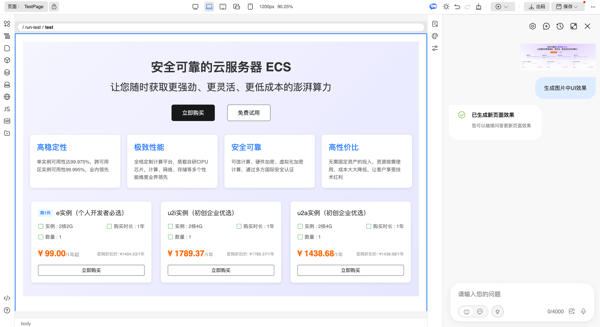
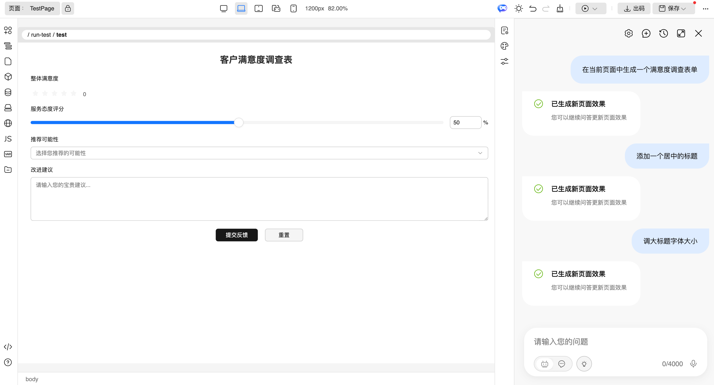
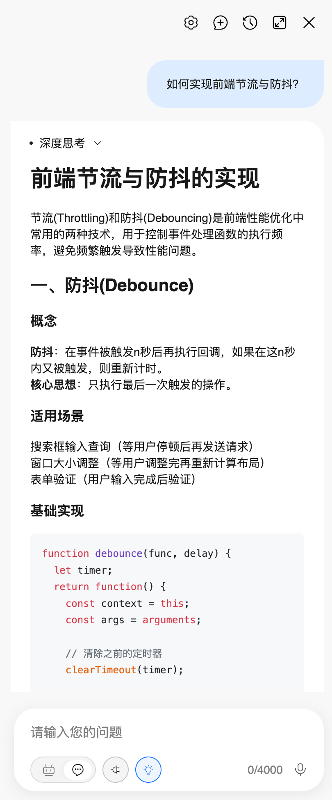
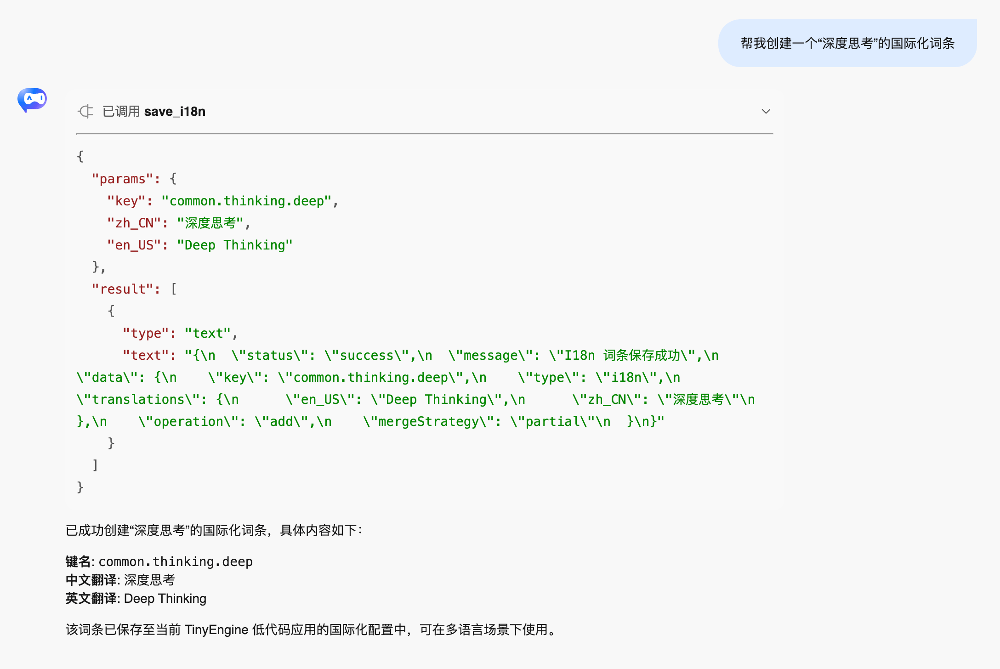
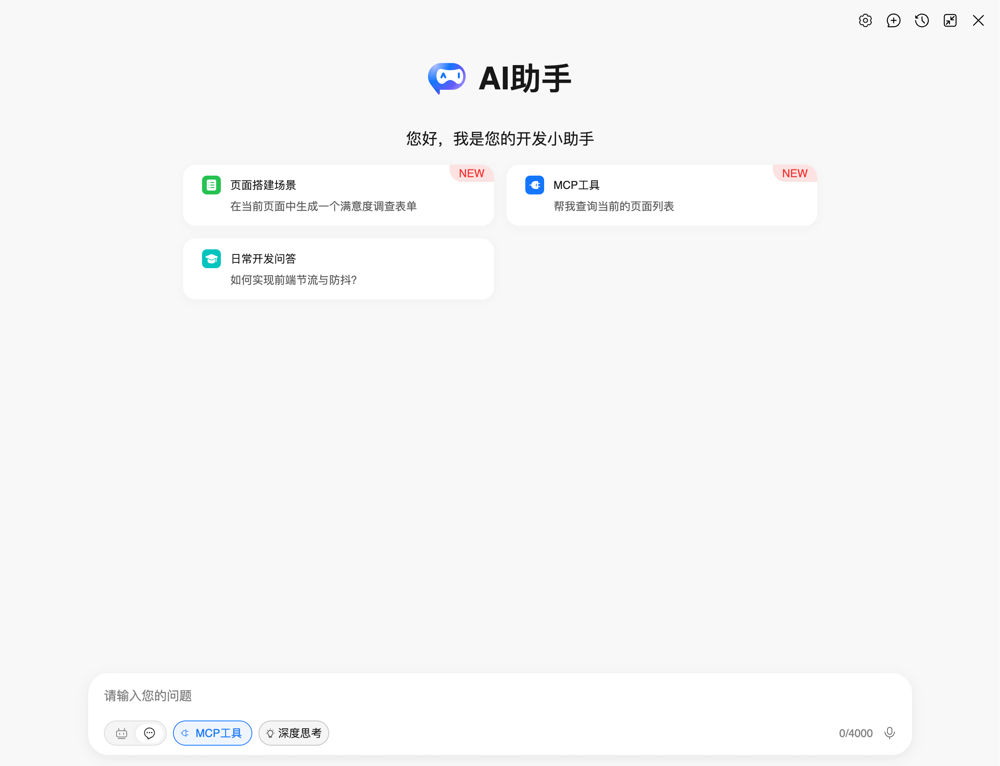

# TinyEngine AI插件使用指南

随着TinyEngine低代码平台的不断升级，AI插件迎来了全面升级。新版AI插件集成了现代化的聊天界面，提供Agent模式和Chat模式双重体验，支持上传图片生成页面，支持MCP（Model Context Protocol）工具调用能力，让AI辅助开发更加智能、强大。

## 一、功能概览

新版AI插件具备以下核心功能：

### 1.1 全新Agent智能搭建模式，支持模式切换

**Agent模式（智能搭建）**
- 支持上传图片或自然语言搭建页面
- 流式页面渲染，实时看到页面效果
- 通过对话创建组件、调整样式、修改属性
- 适合页面搭建、界面调整等场景

**Chat模式（智能对话）**
- 传统问答式交互体验
- 支持代码生成、文档编写、技术咨询
- 支持调用平台MCP工具完成特定任务

### 1.2 核心特性

- **现代化界面**：全新的聊天界面，支持Markdown渲染、代码高亮
- **智能工具调用**：可以调用平台各种工具，如创建页面、修改组件等
- **思考模式**：支持推理模型的深度思考，提供更准确的解决方案
- **多模型支持**：兼容各种主流AI模型
- **会话管理**：支持多个对话会话，自动保存历史记录

## 二、界面介绍

### 2.1 主界面

在编辑器界面右上角插件栏，您可以看到 AI 助手的图标。点击图标即可打开主界面对话窗口。


主界面包含以下元素：
- **顶部工具栏**：包含设置模型、会话管理、全屏切换等功能
- **欢迎区域**：显示AI助手的欢迎信息
- **提示项**：快速开始的常用问题示例
- **对话区域**：显示用户与AI的对话历史
- **输入区域**：用户输入问题区域、上传文件区域，同时包含模式切换、MCP工具、深度思考等按钮




### 2.2 模式切换

新版AI插件支持两种工作模式：

#### Agent模式（默认）
- **文件上传**：支持上传图片生成页面
- **智能页面搭建**：AI可以直接修改页面Schema，实时更新画布
- **实时预览**：修改即时生效，无需手动刷新
- **适用场景**：页面搭建、组件配置、样式调整等

#### Chat模式
- **对话交互**：传统的问答式对话体验
- **工具调用**：支持调用MCP工具完成特定任务
- **适用场景**：咨询问答、代码生成、文档编写等

可以通过底部的模式切换按钮在两种模式间切换。


### 2.3 MCP工具管理



MCP工具管理面板允许用户：
- 查看启用的MCP服务器
- 启用/禁用特定的MCP工具

### 2.4 深度思考
启用推理模型的深度思考功能，AI会自动进行深度思考，提供更准确的解决方案。


### 2.5 模型设置面板

点击顶部的设置图标，可以进入设置面板，包含以下两个配置页签：

#### 模型选择

- **默认助手模型**：选择AI对话使用的主模型，支持按服务商筛选。模型列表会标注能力标签（工具调用、视觉理解）
- **快速模型**：用于代码补全、话题命名等场景，建议选择轻量模型（如flash类型或8b/14b模型）以获得更快响应
- 选择模型后会显示当前模型所属的服务名称及API Key配置状态

#### 模型服务

- **查看服务列表**：展示所有已配置的模型服务，包含Base URL、模型数量、API Key状态
- **配置内置服务**：为内置服务（如OpenAI、DeepSeek等）配置API Key
- **添加自定义服务**：支持添加兼容OpenAI格式的自定义模型服务，需配置：
  - **服务名称**：自定义的服务标识
  - **Base URL**：API地址（支持末尾缺省`/chat/completions`，`#`结尾强制使用输入地址）
  - **API Key**：访问认证信息
  - **模型配置**：添加一个或多个模型，设置模型名称、显示名称及能力（工具调用、视觉理解、快速模型）
- **编辑/删除服务**：可编辑自定义服务的全部配置，或删除自定义服务



**注意**：切换AI模型会开启新的会话；若选择的模型未配置API Key，会提示前往模型服务页签进行配置。

### 2.6 会话管理


用户会话会保存到浏览器缓存中，点击顶部的会话管理图标可以查看当前会话历史

会话管理面板允许用户：
- 查看当前会话历史
- 点击会话可以切换当前会话（图标区分Agent与Chat模式）
- 删除特定的会话

## 三、快速开始

### 3.1 打开AI插件

在TinyEngine编辑器界面左下角插件栏，点击AI助手图标即可打开对话窗口。

### 3.2 首次配置

首次使用时，需要进行简单配置：

1. **选择AI模型**：点击右上角设置按钮，选择合适的AI模型
2. **配置API Token**：输入对应AI服务的API密钥
3. **选择工作模式**：根据需要选择Agent模式或Chat模式

### 3.3 开始使用

配置完成后，您可以：

- **直接对话**：在输入框中输入问题，按回车发送
- **使用提示**：点击界面上的快速提示开始对话
- **上传文件**：在Agent模式下可以上传图片生成页面
- **切换模式**：随时在Agent和Chat模式间切换

### 3.4 进阶配置（可选）

对于开发者，可以进行更多自定义配置：
通过在注册表中添加options配置项，可以配置AI模型、上下文功能开关等。
```javascript
// registry.js
export default {
  // ......
  [META_APP.Robot]: {
    options: {
      // enableResourceContext: false, // 提示词上下文携带资源插件图片，默认true
      // enableRagContext: true, // 提示词上下文携带查询到的知识库内容，默认false
      // customCompatibleAIModels: [] // 自定义AI模型(OpenAI兼容格式)
    }
  },
  // ......
}
```


#### 自定义AI模型
```javascript
// 在项目配置中添加OpenAI兼容格式自定义模型，也支持删除内置模型服务和模型
customCompatibleAIModels: [
  // ==================== 示例 1：删除整个服务 ====================
  // 删除 DeepSeek 服务
  {
    provider: 'deepseek',
    _remove: true
  },

  // ==================== 示例 2：修改现有服务 ====================
  // 修改阿里云百炼服务：删除部分模型 + 添加新模型 + 覆盖配置
  {
    provider: 'qwen',
    // 可选：修改服务的显示名称
    label: '阿里云百炼 (自定义)',
    // 可选：修改服务的 baseUrl
    // baseUrl: 'https://dashscope.aliyuncs.com/compatible-mode/v1',
    models: [
      // 删除不需要的模型
      { name: 'qwen-turbo', _remove: true },
      { name: 'qwen-plus', _remove: true },

      // 添加新模型
      {
        label: 'Qwen Max',
        name: 'qwen-max',
        capabilities: {
          toolCalling: true,
          vision: true,
          reasoning: true
        }
      },

      // 覆盖已有模型的配置
      {
        label: 'Qwen2.5-72B (推荐)',
        name: 'qwen2.5-72b-instruct',
        capabilities: {
          toolCalling: true,
          vision: false,
          reasoning: false,
          compact: false
        }
      }
    ]
  },

  // ==================== 示例 3：添加全新的 OpenAI 服务 ====================
  {
    provider: 'openai',  // AI模型提供商
    label: 'OpenAI', // AI模型名称
    baseUrl: 'https://api.openai.com/v1', // AI模型API地址
    allowEmptyApiKey: false, // 是否允许API Token为空
    models: [
      {
        label: 'GPT-4o', // AI模型名称
        name: 'gpt-4o', // AI模型名称
        capabilities: {
          toolCalling: true, // 是否支持工具调用
          vision: true, // 是否支持视觉理解
          reasoning: true // 是否支持推理
        }
      },
      {
        label: 'GPT-4o Mini',
        name: 'gpt-4o-mini',
        capabilities: {
          toolCalling: true,
          vision: true,
          compact: true
        }
      },
      {
        label: 'o1-preview',
        name: 'o1-preview',
        capabilities: {
          toolCalling: false,
          vision: false,
          reasoning: true
        }
      }
    ]
  }
]
```

#### 自定义Agent模式上下文功能

- enableResourceContext: 该参数配置是否在提示词上下文携带资源插件图片，AI会在生成的页面中自动合适的图片资源，默认开启
- enableRagContext: 该参数配置是否在提示词上下文携带查询到的知识库内容，可以根据场景在后端知识库中添加文档知识，以优化AI的生成效果，默认关闭


#### 其他配置
- encryptServiceApiKey: 该参数配置是否加密服务API密钥
- modeImplementation: 该参数配置Agent模式/Chat模式的实现，支持自定义Agent模式/Chat模式的实现


#### 本地开发代理（可选）
```javascript
// vite.config.js - 用于本地开发调试
proxy: {
  '/app-center/api/chat/completions': {
    target: 'https://api.deepseek.com',
    changeOrigin: true,
    rewrite: path => path.replace('/app-center/api/chat/completions', '/v1/chat/completions')
  },
  '/app-center/api/ai/chat': {
    target: 'https://api.deepseek.com',
    changeOrigin: true,
    rewrite: path => path.replace('/app-center/api/ai/chat', '/v1/chat/completions')
  }
}
```

## 四、开始对话

### 4.1 Agent模式

图片生成页面：
首先切换到Agent模式，然后点击上传图片按钮，上传您想要生成页面的图片。




自然语言生成页面：
切换到Agent模式，然后直接在输入框中输入您想要生成页面的描述，AI会根据您的描述生成页面。




### 4.2 Chat模式

Chat模式支持传统的问答式交互体验，AI会根据您的问题提供答案。同时支持调用MCP工具完成特定任务。



## 五、MCP工具使用

### 5.1 什么是MCP工具

MCP（Model Context Protocol）工具让AI能够调用平台的各种功能，实现真正的智能操作：

- **页面管理**：创建、删除、修改页面
- **组件操作**：添加、配置、调整组件
- **样式设置**：修改CSS样式和布局
- **数据查询**：获取项目信息、页面列表等
- **资源管理**：处理图片、文件等资源

### 5.2 如何启用工具

1. **打开工具面板**：点击输入框旁的"MCP"按钮
2. **查看可用工具**：浏览平台提供的各种工具
3. **启用所需工具**：勾选您需要使用的工具
4. **开始使用**：AI会在需要时自动调用这些工具


### 5.3 工具调用示例

AI会根据您的需求自动选择和调用合适的工具：

**示例对话：**
```
用户：帮我查看当前项目有哪些页面
AI：我来为您查询项目中的页面信息...
[自动调用页面查询工具]
AI：当前项目包含以下页面：首页、用户管理、设置页面...
```

**工具执行过程：**
- 🔄 AI识别需求并选择工具
- ⚙️ 自动调用相应的平台功能
- 📊 展示执行结果和详细信息
- ✅ 可展开查看调用参数和返回值



## 六、典型使用场景

### 6.1 Agent模式 - 智能页面搭建

Agent模式让您可以通过对话直接操作页面，实时看到效果。

#### 创建新组件
```
用户：在页面中添加一个用户信息表单，包含姓名、邮箱、手机号字段
AI：页面正在生成中,请稍等片刻...
[实时更新页面布局]
[完成后插件界面会更新提示和状态]
```

#### 修改组件属性
```
用户：将页面中的按钮文字改为"提交表单"，颜色设为主色
AI：页面正在生成中,请稍等片刻...
[实时更新页面布局]
[完成后插件界面会更新提示和状态]
```

#### 调整布局和样式
```
用户：调整表单布局，让字段按两列显示，添加一些间距
AI：页面正在生成中,请稍等片刻...
[实时更新页面布局]
[完成后插件界面会更新提示和状态]
```

### 6.2 Chat模式 - 智能对话交互

Chat模式适合传统的问答式交互和工具调用。

#### 代码生成和解释
```
用户：帮我写一个 Vue3 的表单验证组件
AI：我来为您创建一个Vue3表单验证组件...
[返回完整的Vue3组件代码和使用说明]
```

#### MCP工具调用
```
用户：查询当前项目的所有页面
AI：我来查询项目中的页面信息...
[调用MCP工具获取页面列表]
AI：当前项目包含以下页面：...
```

### 6.3 思考模式 - 深度推理

对于支持推理能力的模型（如DeepSeek Reasoner），可以启用思考模式：

```
用户：设计一个复杂的电商购物车页面，需要考虑用户体验和性能优化
AI：[开始深度思考]
让我仔细分析这个需求...
首先，电商购物车页面需要考虑以下几个方面：
1. 用户体验方面...
2. 性能优化方面...
3. 功能设计方面...
[经过深度思考后提供详细的设计方案]
[最后AI会提供一个完整的页面设计，包括组件、布局、样式等]
```

## 七、实用功能

### 7.1 会话管理

- **多会话支持**：可以同时进行多个不同主题的对话
- **历史记录**：自动保存所有对话内容，随时查看
- **智能标题**：根据对话内容自动生成有意义的标题
- **快速搜索**：在历史对话中快速找到需要的内容

### 7.2 工具调用

- **自动识别**：AI会根据您的需求自动选择合适的工具
- **可视化结果**：工具执行结果以易读的方式展示
- **操作记录**：清晰记录每个工具的调用过程和参数
- **错误重试**：当工具执行失败时，可以重新尝试

### 7.3 智能提示

- **快速开始**：提供常用场景的示例问题，点击即可使用
- **上下文提示**：根据当前页面情况提供相关建议
- **功能引导**：帮助新用户快速上手各项功能

### 7.4 界面体验

- **富文本支持**：支持Markdown格式，可以显示表格、列表、代码等
- **代码高亮**：自动识别并高亮显示各种编程语言
- **全屏模式**：可以将对话窗口放大到全屏，获得更好的使用体验



## 八、注意事项

### 8.1 使用前准备

1. **保存提醒**：在使用Agent模式修改页面前，请确保当前页面已保存
2. **网络要求**：需要稳定的网络连接支持流式数据传输
3. **API配置**：确保正确配置了AI模型的API Token和基础URL
4. **浏览器兼容性**：建议使用现代浏览器，支持最新的Web标准

### 8.2 模式选择建议

- **Agent模式**：适用于页面搭建、组件修改、样式调整等直接操作场景
- **Chat模式**：适用于咨询问答、代码生成、文档编写等对话场景
- **思考模式**：仅在使用支持推理的模型时启用，会增加响应时间

### 8.3 性能优化

- **消息历史**：定期清理过多的对话历史以保持性能
- **流式处理**：在网络较慢时可能出现延迟，属于正常现象
- **工具调用**：复杂的工具调用可能需要较长时间，请耐心等待

## 九、故障排除

### 9.1 连接问题

**现象**：无法连接AI服务或请求超时

**解决方案**：
- 检查网络连接是否稳定
- 确认API Token和基础URL配置正确
- 检查代理配置是否正确（本地开发环境）
- 查看控制台网络请求错误信息

### 9.2 Agent模式问题

**现象**：页面更新失败或显示异常

**解决方案**：
- 检查当前页面是否已保存
- 确认页面格式正确
- 查看控制台错误信息
- 尝试新建会话并创建新空白页面再重试

### 9.3 MCP工具问题

**现象**：MCP工具无法调用或调用失败

**解决方案**：
- 检查MCP工具管理面板中的工具状态
- 查看控制台MCP服务错误信息
- 尝试重新启用对应的工具

### 9.4 性能问题

**现象**：界面卡顿或响应缓慢

**解决方案**：
- 清理过多的对话历史
- 关闭不必要的浏览器标签页
- 检查浏览器内存使用情况
- 尝试刷新页面或重启浏览器

### 9.5 紧急恢复

如果遇到严重问题，可以尝试以下步骤：

1. **清除缓存**：清除浏览器缓存和LocalStorage
2. **重置配置**：在设置面板中重新配置AI模型
3. **重启服务**：重启开发服务器（本地开发环境）
4. **联系支持**：如问题依然存在，请在[GitHub](https://github.com/opentiny/tiny-engine/issues)提交问题

## 十、总结

### 10.1 为什么选择新版AI插件

新版AI插件相比以往版本带来了显著改进：

**更强大的功能**
- 多模态支持，支持上传图片或者自然预研搭建页面
- 双模式设计满足不同使用需求：既可以直接搭建页面，也可以进行技术咨询
- 智能工具调用让AI能够实际操作平台功能，而不仅仅是对话
- 思考模式提供更深入的分析和解决方案

**更好的体验**
- 现代化的界面设计，支持富文本显示和代码高亮
- 实时响应，无需等待，边说边看到结果
- 完善的会话管理，不用担心丢失重要对话

**更简单的使用**
- 无需复杂配置，开箱即用
- 智能提示帮助快速上手
- 支持多种AI模型，灵活选择

### 10.2 实际价值

使用新版AI插件，您可以：

- **大幅提升开发效率**：原本需要手动点击多次的操作，现在只需一句话
- **降低学习成本**：新手也能快速上手，无需深入学习复杂功能
- **减少出错概率**：AI辅助生成的代码更加规范和可靠

### 10.3 未来更新计划

我们正在不断改进和完善AI插件，即将推出：

**后续更新**
- 优化AI生成能力，生成更准确、更稳定的页面UI效果
- 更好的组件支持
- 结合模板实现更好的效果
- 优化性能，让响应更快、体验更流畅

**长期愿景**
- 应用级的代码生成
- 更智能的代码生成和优化建议

---

新版AI插件不仅仅是一个工具，更是您的智能开发助手。它将帮助您在TinyEngine平台上实现更高效、更智能的低代码开发体验。现在就开始使用吧！
