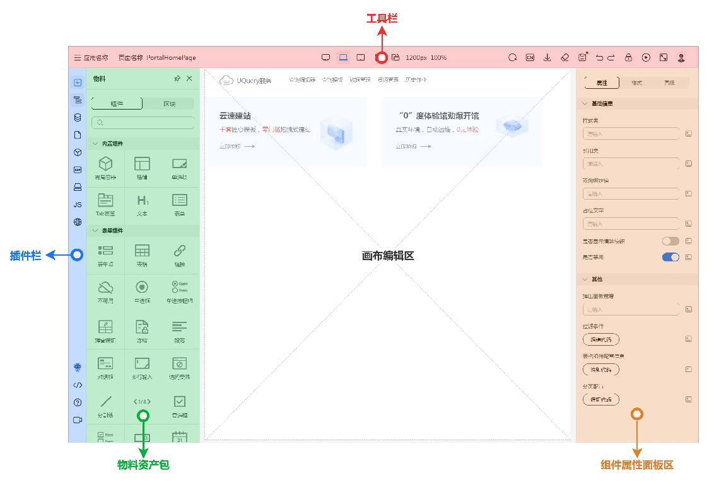
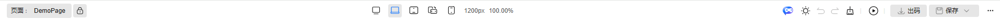
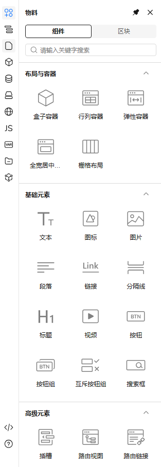
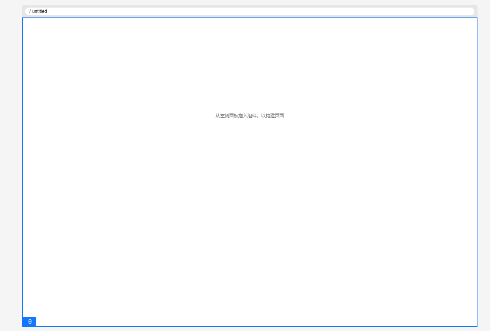
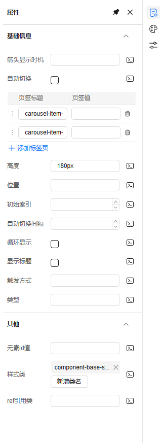
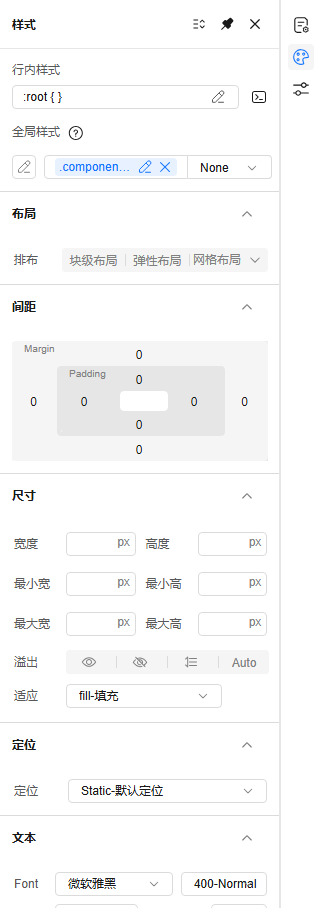
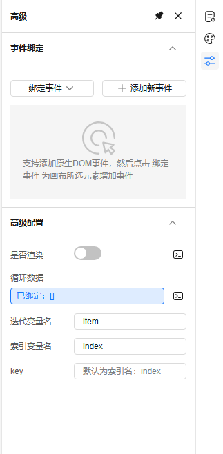
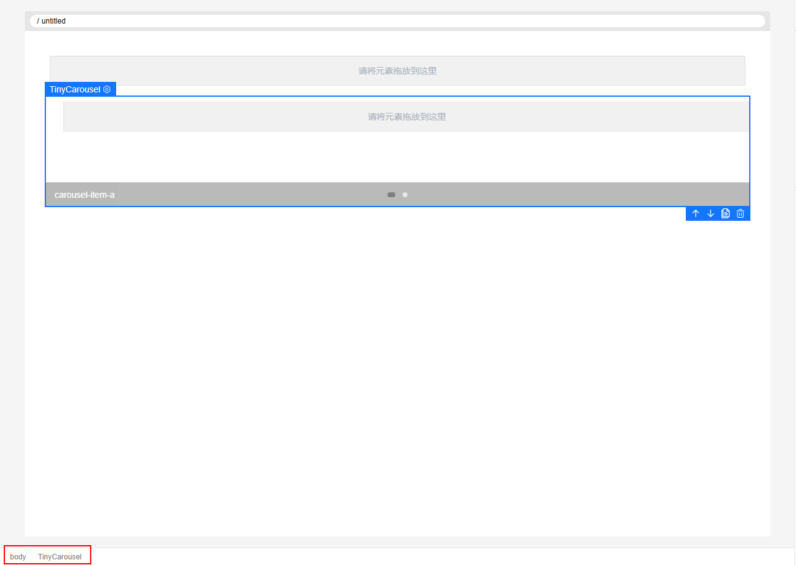

# 设计器界面模块简介

> 本节主要简单介绍设计器界面模块

## 设计器界面概览

如上图，设计器可以分为顶部工具栏、左侧插件栏、中间画布区、右侧设置面板等几个主要界面模块

## 顶部工具栏

如上图所示，设计器顶部的工具栏从左到右包括：

- 面包屑（展示当前编辑页面或区块）
- 解锁/锁定功能（解锁或锁定当前编辑页面或区块）
- 多终端工具切换（画布宽度切换）
- AI助手（打开AI对话框）
- 主题切换功能（切换亮色主题或暗色主题）
- 撤销回退功能，撤销或回退上一步操作
- 画布清除工具（清空当前画布）
- 预览功能，打开新 Tab 预览当前页面或区块
- 下载源代码，将当前数据转换并生成代码到本地
- 保存功能，保存当前页面或区块数据
- 更多功能包括：多人协作、刷新画布、切换全屏、切换到嵌套视图、中英文切换等

## 左侧插件栏

如上图所示，插件面板主要有物料插件、大纲树插件、页面管理工具插件、区块管理插件、数据源管理插件、资源管理插件、国际化插件、JS 方法插件、状态管理插件、附件资源管理插件、模型管理插件

插件点击之后会向右展开对应插件的设置面板

## 中心画布

如上图所示，中心画布位于设计器中央，是可视化设计的核心模块，可以在插件栏中的物料面板往中心画布拖入组件，也可以点击画布选中组件，修改组件的属性、样式、绑定事件等等

## 右侧设置面板

右侧设置面板分为属性设置、样式设置、高级设置等面板

- 属性设置，设置组件的属性，比如按钮组件的 size、文案、按钮类型等等组件提供配置的属性

- 样式设置，设置组件的样式，提供直接配置样式，也可以编写 CSS 代码配置样式

- 高级设置，设置组件是否渲染、绑定点击事件、设置组件是否循环渲染等等

## 底部节点树

底部节点树展示了从 body 到当前选中节点的层级，点击可切换层级
