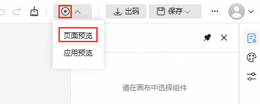
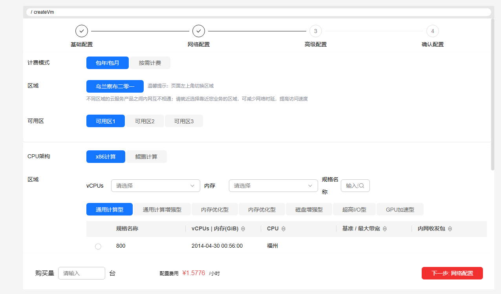
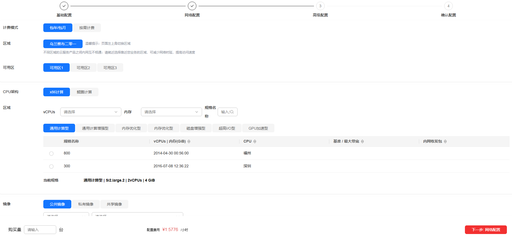
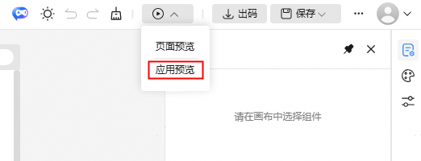
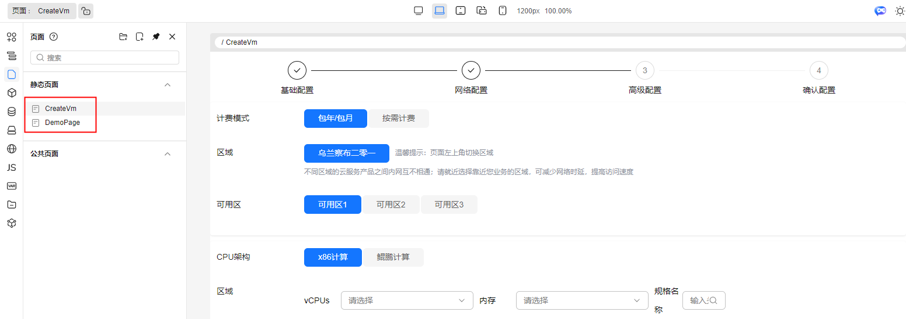
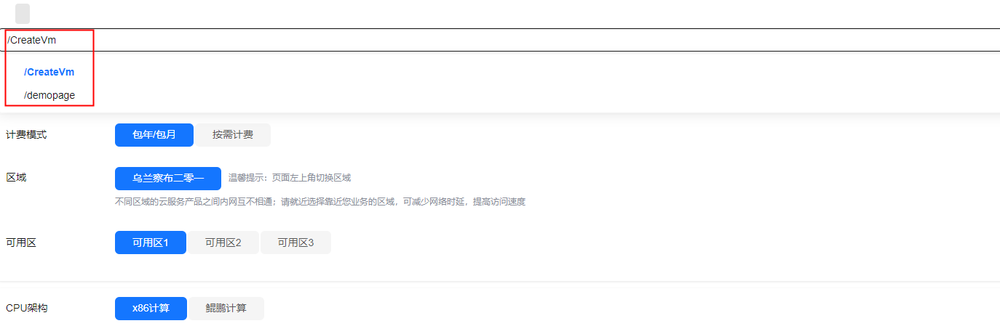

# 设计器预览

## 页面·区块预览/页面预览

### 前言

在一些场景下，设计器画布无法直观展示区块或页面的最终呈现效果。比如说，当页面中的区块与组件嵌套层级过多，或彼此间的交互逻辑复杂，我们将难以在设计画布上直观感知其静态布局以及复杂的动态交互行为，这时候就需要设计器的**页面/区块预览**能力来为开发提供帮助

### 页面·区块预览入口

工具栏预览默认点击图标时进入页面·区块预览，功能同展开下拉列表点击页面预览

### 示例

画布上的页面结构

预览页的页面效果

页面·区块预览界面除了帮助我们直观的看到整体页面结构以及动态交互动作外，还可以提供其他功能验证

- 切换设备宽度
- 国际化语言
- state 状态响应式
- 表单验证提交

## 应用预览

### 前言

在之前的预览插件中只能实现单个页面的预览，无法满足多个页面之间的交互跳转场景的验证
应用预览即是解决这个问题，不仅能够预览完整的项目及源码，而且支持手动路由切换，可以查看任意页面的效果

### 应用预览入口

展开预览图标的下拉列表，点击应用预览

### 示例

画布上的页面结构，当前示例应用共包含两个页面

### 预览页的效果

可以看到如下图的应用预览界面除了具备 页面·区块预览 的交互和验证功能外，还提供了
- 手动路由切换（添加了路由切换栏，图中标注的部分，树状结构）
- 路由功能验证（跳转、回退等）

