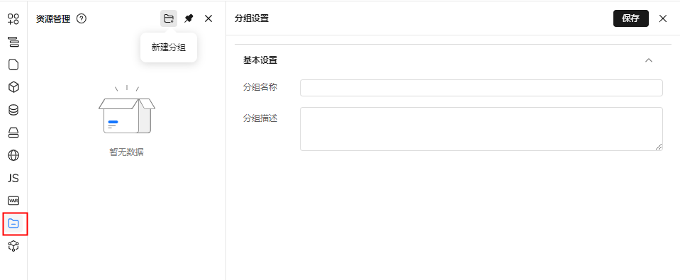
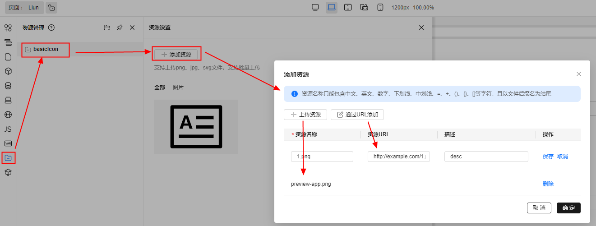
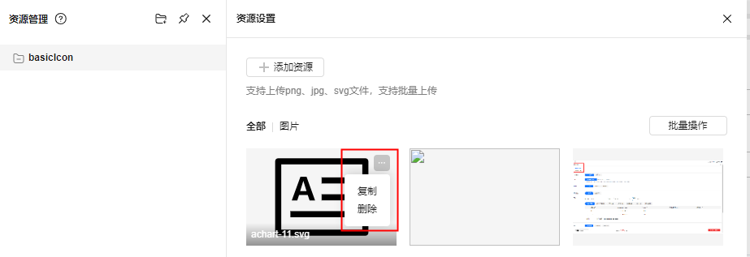
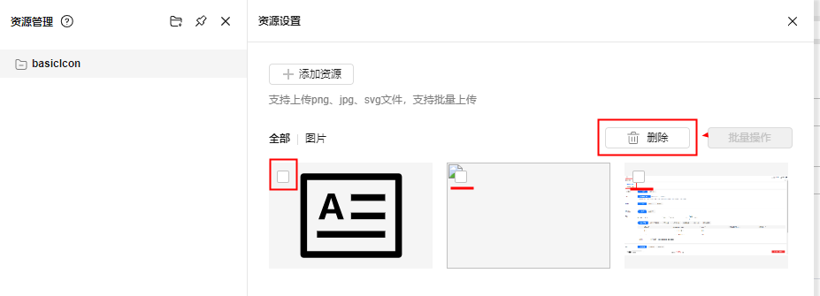
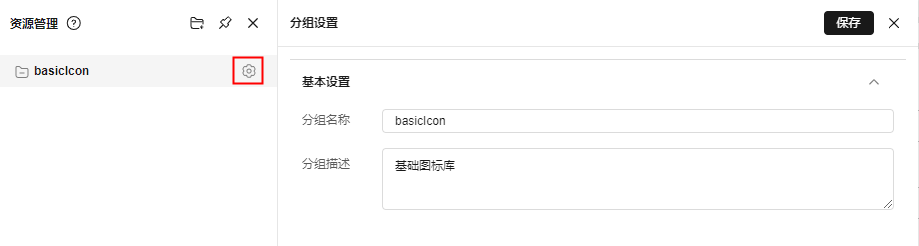
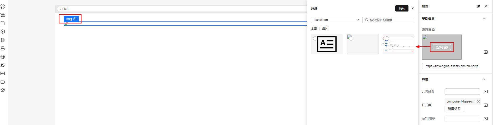
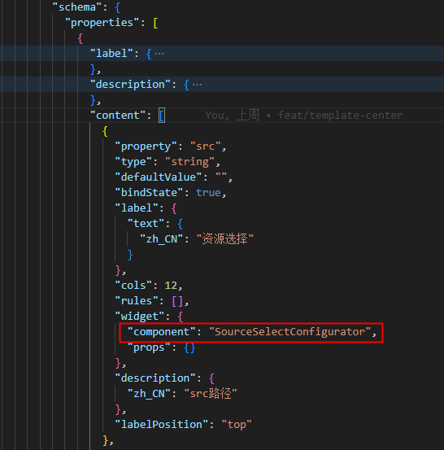

# 资源管理

> 资源管理插件可以管理该应用下的静态资源，包括各种图片图标等，可以新增分类，可以新增资源URL链接，可以上传资源，以及对资源的增删操作及分类的增删改操作

### 新增分类

分类即对资源类型进行分组管理，如基础图标库，XXX模块资源库，只需点击新增分类图标，然后填入名称、描述，点击保存即可完成新增操作

### 新增资源

点击分类打开分类管理面板，在该面板点击添加资源按钮，在弹窗里可以选择通过URL添加和上传，通过URL添加必须输入资源名称和资源URL，资源名称和URL唯一，已添加的资源列表可以随时点击行进行操作调整，添加足够的资源并确定无误后，点击确定批量添加资源

### 删除、复制资源

在资源右上角的more-icon处hover会弹出复制和删除的操作，复制会复制该资源的URL，删除则需要二次确认方可删除

### 批量操作资源

点击批量操作，会在该按钮左侧弹出可以进行的批量操作，目前只有批量删除功能，资源列表中的内容变为可勾选，勾选需要操作的资源后，点击删除即可完成批量删除（需要二次确认）

### 编辑资源分类

在资源分类列表上hover会出现齿轮的图标，点击即可编辑分类信息，编辑完成后点击保存即可完成修改

#### 使用资源

我们在图片的物料中内置了选择资源的组件 SourceSelectConfigurator，只要配置了这个Configurator的组件都可以进行资源选择并绑定

#### 其他组件使用资源

如果需要在其他组件或自定义组件中使用资源，只需要配置bundle.json中相关的属性即可

