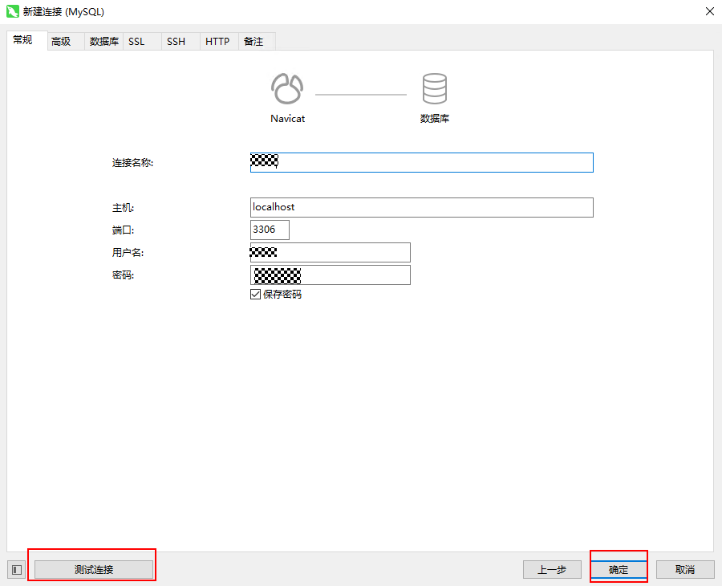
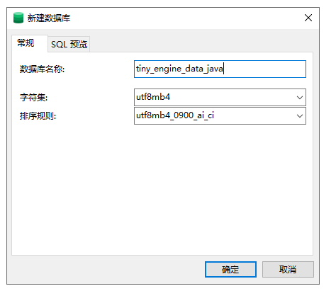
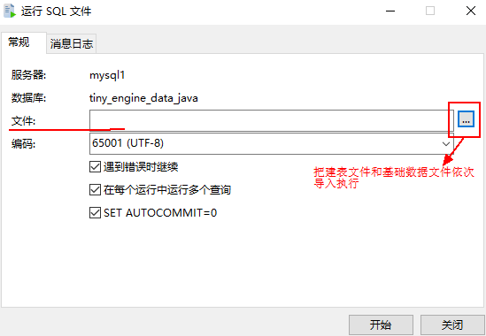
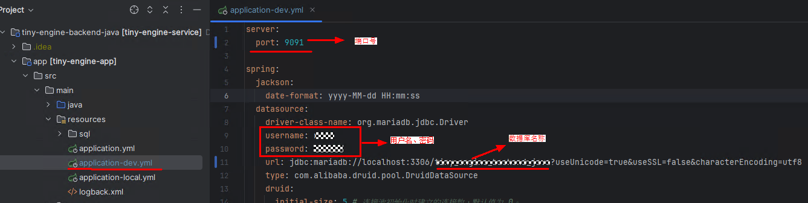
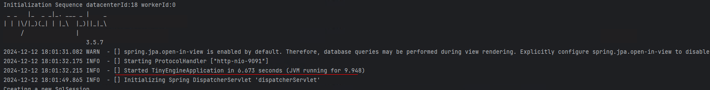
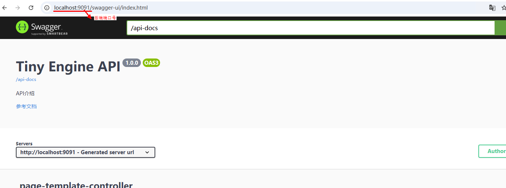
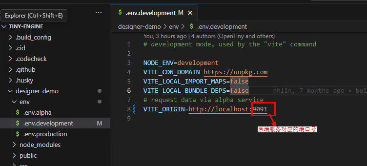
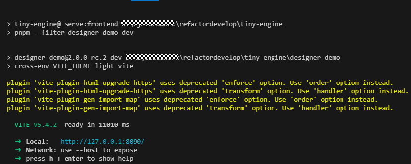
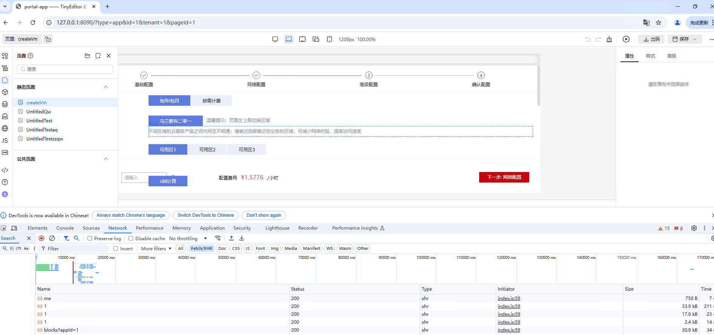

# 前后端代码本地启动联调

本篇主要介绍在本地启动TinyEngine前端并对接本地Java版本后端方式（默认为前端使用mockServer方式）进行开发联调。

**Tips:**

- 对接 Node.js 版本服务端与 Java 版本服务端过程类似。另外 Node.js 版本后续不再进行新特性开发，只维护基础功能，建议使用 Java 版本服务端。
- 本篇以 Clone 前端源码方式启动为例，使用 CLI 创建新设计器启动前端方式对接后端与之类似。

## 启动前的准备

- clone tiny-engine：[代码仓库](https://github.com/opentiny/tiny-engine/tree/refactor/develop)
- clone tiny-engine-backend-java：[代码仓库](https://github.com/opentiny/tiny-engine-backend-java)

## 启动服务


### 1.后端启动

#### 1.1 新建数据库
首先新建 MySQL 数据库连接，以 Navicat 为例：

选择“新建连接”->“MySQL”->“下一步”->输入连接名称、用户名、密码->“测试连接”->“确定”

如下图所示



继续新建数据库：
“新建数据库”->输入数据库名称

如下图所示



#### 1.2 执行 SQL 文件导入数据库表与基础数据

**在按照上述操作后的新建的数据库名称上右键选择“运行 SQL 文件”->在文件项选择下面两个 SQL 文件导入运行**

如下图所示



执行以下 SQL 文件去创建设计器涉及的表（按照序号依次导入执行），目录如下:

`tiny-engine-backend-java/app/src/main/resources/sql/mysql/*.sql`


执行以下 SQL 文件去添加表的基础数据（按照日期依次导入执行），目录如下：

`tiny-engine-backend-java/app/src/main/resources/sql/mysql/init_data*.sql`

**Tips:** 多条 SQL 依次导入比较麻烦，可以拼接成一条 SQL 一次性导入该 SQL：

```sh
cd docker-deploy-data/mysql/init
cat ./*.sql > complete.sql
# 导入complete.sql
```


#### 1.3 修改数据库等相关的配置项

在 `tiny-engine-backend-java/app/src/main/resources/application-dev.yml` 文件中设置自己的端口号 `port`（和前端 `tiny-engine/designer-demo/env/.env.development` 文件中的 `VITE_ORIGIN` 变量中的端口号保持一致）、还有数据库连接信息（用户名 `username`、密码 `password`、`URL`）



#### 1.4 启动后端项目

**步骤一**：先安装 Maven，若没有从 [Maven 官网](https://maven.apache.org/download.cgi) 下载并解压，Maven 3.5 以上即可，并配置环境变量

**步骤二**：在项目根目录执行构建打包

```sh
mvn clean package
```

**步骤三**：在项目根目录执行启动

```sh
java -jar app/target/tiny-engine-app-1.0-SNAPSHOT.jar
```

执行后终端中看到下图界面表示后端服务启动成功：



Swagger 访问链接路径：
`localhost:9091/swagger-ui.html`

**可详细查看接口 API**：



### 2. 前端启动

- 把前端项目工程导入 VSCode 后下载依赖，进入项目根目录下执行  `pnpm i`

- 修改文件配置

修改 `tiny-engine/designer-demo/env/.env.development`中的 `VITE_ORIGIN` 变量为自己本地的服务端地址端口：



- 在项目根目录下执行启动

```sh
pnpm dev:withAuth
```

出现如下图所示表示启动成功，启动成功后浏览器会自动打开设计器页面：



前后端启动成功后页面自动弹出，如下可看连接数据库数据接口调通能返回正常数据：



按照以上步骤执行前后端操作，即已成功启动本地前后端关联进行调试。
