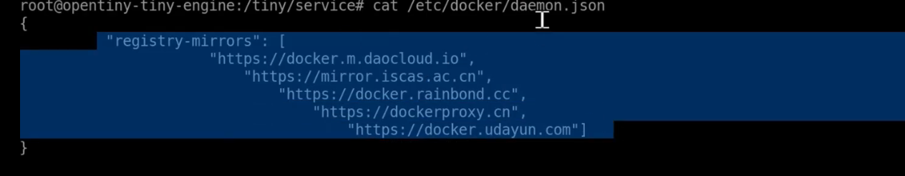
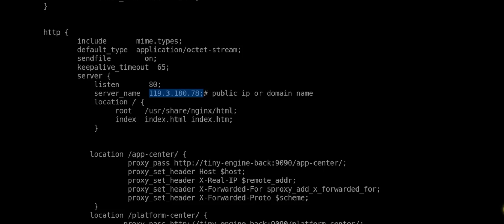

# 前端及Java服务端docker部署

## 1、环境准备
- **工具安装**
  
  根据自己的linux操作系统安装docker，配置国内镜像加速，编辑/etc/docker/daemon.json文件镜像地址，如图

  ```sh
  {
    "registry-mirrors": [
      "https://docker.m.daocloud.io",
      "https://mirror.iscas.ac.cn",
      "https://docker.rainbond.cc",
      "https://dockerproxy.cn",
      "https://docker.udayun.com"	  
      ]
  }
  ```
  
  

  编辑完成后重载配置重启docker
  ```sh
  sudo systemctl daemon-reload
  sudo systemctl restart docker
  ```
  docker-compose安装
  ```sh
  sudo curl -L "https://ghproxy.com/https://github.com/docker/compose/releases/latest/download/docker-compose-$(uname -s)-$(uname -m)" -o /usr/local/bin/docker-compose
  sudo chmod +x /usr/local/bin/docker-compose
  ```
- **拉取代码**
  ```sh
  git clone -b develop https://github.com/opentiny/tiny-engine.git
  git clone -b develop https://github.com/opentiny/tiny-engine-backend-java.git
  ```
## 2、配置修改
- **nginx配置修改**
    
    修改 Java 项目 /tiny-engine-backend-java/docker-deploy-data/nginx.conf 文件，如图所示将ip改为自己服务器ip或域名
    

## 3、服务启动与停止
      
- **服务启动** 
  
    在 Java 项目根目录 docker-compose.yml 文件同级执行命令
  ```sh
  docker-compose up -d
  ```  
- **服务停止** 
  
  ```sh
  docker-compose stop
  ```   
## 4、视频讲解
- [TinyEngine实操教程（4）——前后端部署](https://www.bilibili.com/video/BV1gGgcz8Eek/?spm_id_from=333.1387.homepage.video_card.click&vd_source=ea0e34d0a465d263673f7f36dcae0edf)    